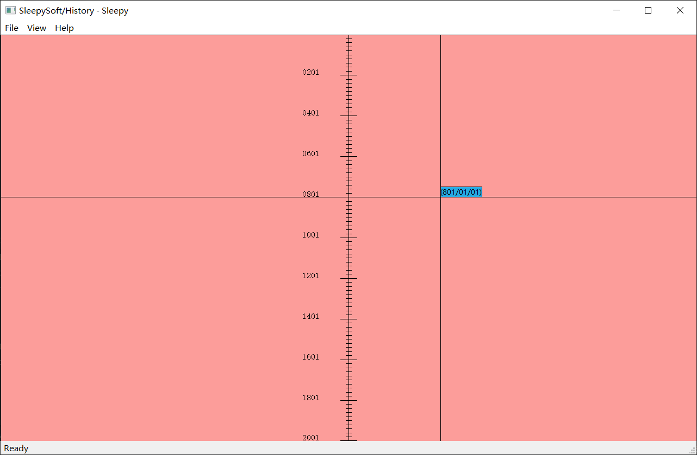
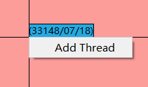
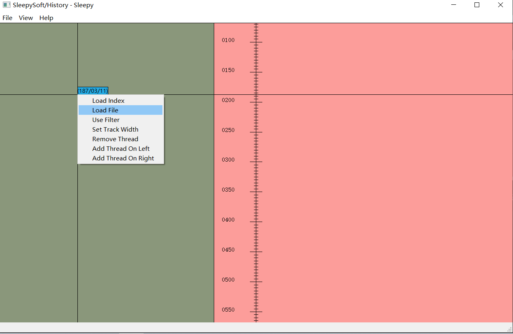
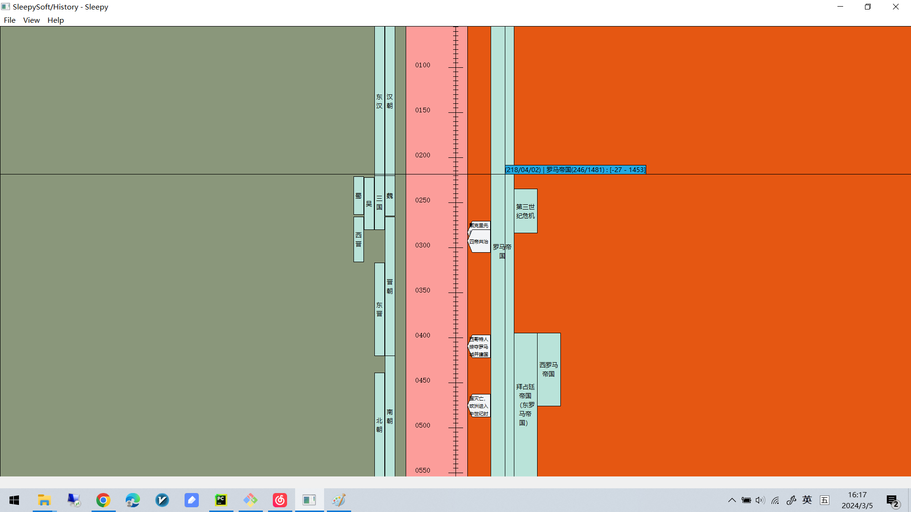
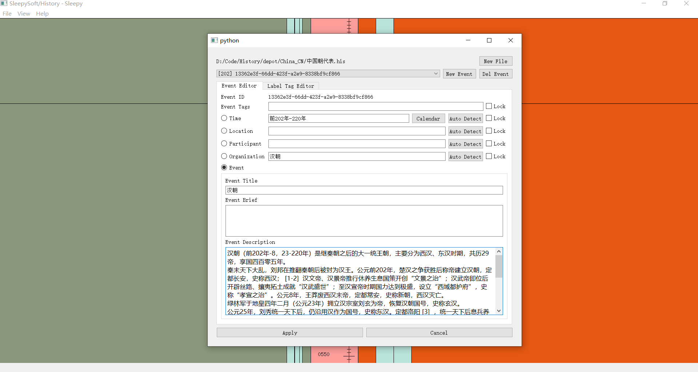
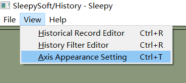
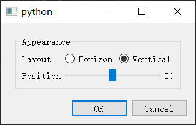
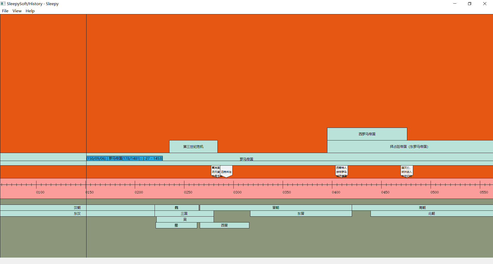

## 历史事件浏览器（Viewer）

## 浏览区域

软件打开时界面如下，此时只有时间轴和光标。光标旁边的蓝色提示区显示当前位置的时间。

这个界面可以通过拖动和鼠标滚轮的方式移动时间轴。

按着CTRL加鼠标滚轮可以调整时间轴的尺度，尺度的调整粒度从大到小如下：

+ 大格刻度10000年，小刻度1000年
+ 大格刻度5000年，小刻度500年
+ 大格刻度2500年，小刻度250年
+ 大格刻度2000年，小刻度200年

+ 大格刻度1000年，小刻度100年
+ 大格刻度500年，小刻度50年
+ 大格刻度250年，小刻度25年
+ 大格刻度200年，小刻度20年

+ 大格刻度100年，小刻度10年
+ 大格刻度50年，小刻度5年
+ 大格刻度10年，小刻度1年

+ 大格刻度1年，小刻度1个月
+ 大格刻度6个月，小刻度1个月
+ 大格刻度3个月，小刻度15天
+ 大格刻度3个月，小刻度15天
+ 大格刻度1个月，小刻度7天
+ 大格刻度10天，小刻度1天

+ 大格刻度1天，小刻度2个小时

> 实际上这是可以调整的，在程序中通过STEP_LIST列表指定。

在空白的地方点击右键，选择“添加时间线（Add Thread）”。

> 软件设计的最初的目的就是将不同历史在同一个时间线上进行对比。

> 在时间轴的哪边添加时间线，则时间线显示在时间轴的哪边。

在添加的时间线上再次点击右键，选择“打开文件（Load File）”，并在打开的文件选择窗口中选择一个.his文件。

> “Load Index”和“Use Filter”是设计用来打开一系列相关历史事件及通过条件过滤历史事件的，暂时没有实现。

> “Set Track Width”可以调整时间线内显示事件的轨道（Track）宽度（不是时间线宽度，时间线宽度是自动分配的）

> “Remove Thread”用来移除当前时间线

> “Add Thread on Left/Right”用来在当前时间线左边/右边添加新的时间线。注意不是时间轴的左边/右边。

历史文件打开后界面如下所示：

> 历史事件分为两类：持续性事件和单点事件。由于布局的关系，单点事件只显示在最靠近时间轴的轨道（Track）上。

> 当鼠标移动到持续性事件上，蓝色提示区会显示当前事件的标题，当前是该事件的第几年/该事件持续几年，该事件的起止时间。

> 当鼠标移动到单点事件上，则显示当前事件的标题及该事件发生的时间。

双击事件可以查看该历史事件的详细信息及进行编辑（编辑请参考“编辑器一章”）。

通过菜单栏的这一选项可以调整时间轴的布局方式（水平/垂直）以及时间轴在界面中的位置。

下图是水平布局且时间轴处于30%位置的效果。

